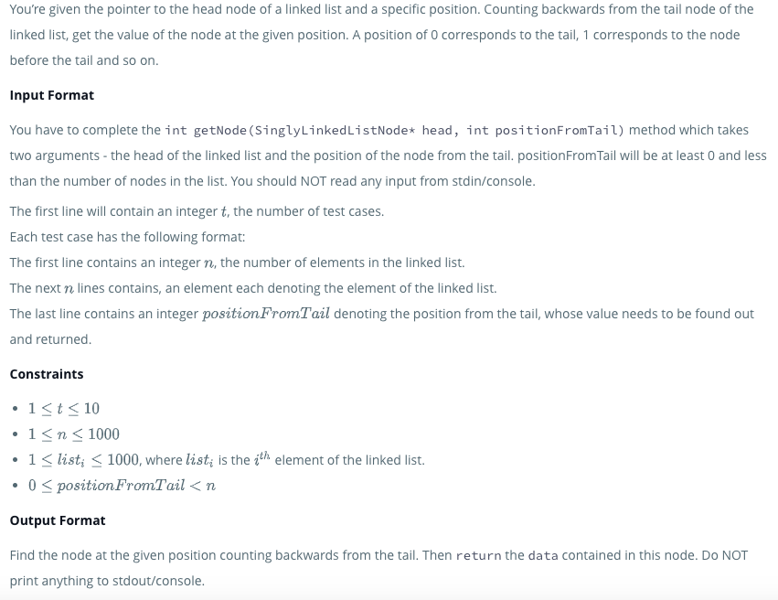
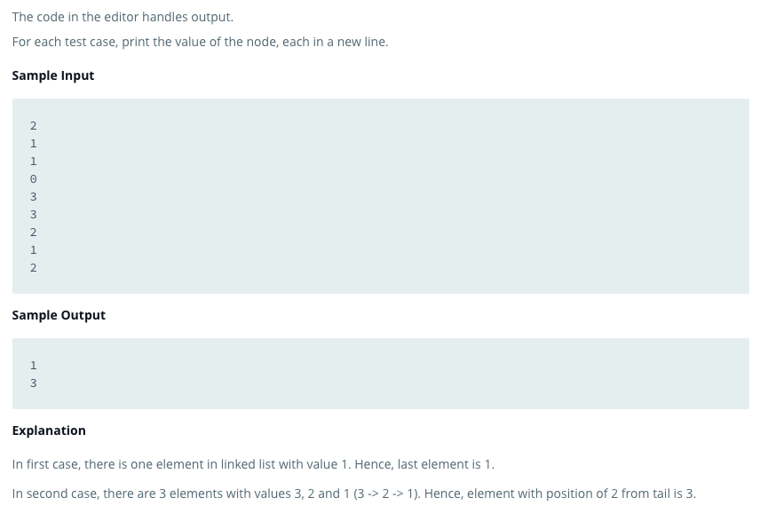

##IT IS IPORTANT TO KNOW THAT THIS CODE MUST BE EXECUTED THROUGH HACKERANK, I HAVE PERSONALLY NOT FIGURED OUT A WAY TO EXECUTIVE THIS USING SOMETHING SUCH A NODE.JS AND DISPLAYING THE RESULTS IN THE TERMINAL##

;
;